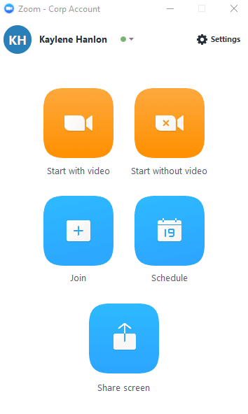
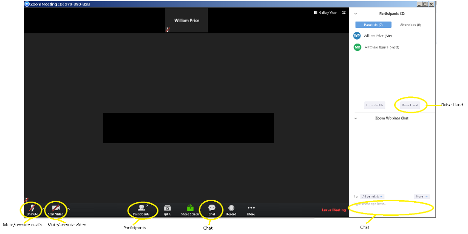
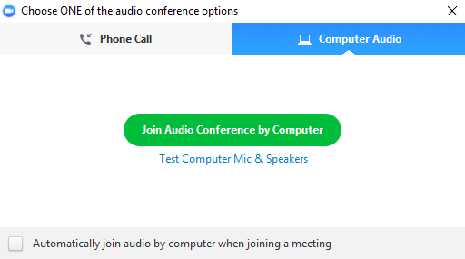
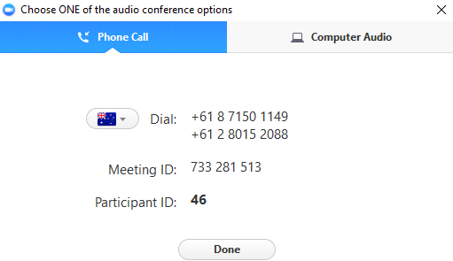

# (PART) Overview {-}

# Introduction

Welcome to the Clinical Pharmacy Program!

This booklet provides key information about the course provided within the Master of Clinical Pharmacy and Graduate Certificate of Clinical Pharmacy.

The program is delivered externally using Blackboard and Zoom.
There are also couple of optional for face-to-face activities throughout the program.

Bookmark the online version for quick reference or download this document as `pdf`: [ProgramInformation.pdf](ProgramInformation.pdf).

<!--chapter:end:index.rmd-->

# Quick start guide

If you are new to the program this booklet provides information on the key resources that we use within the program and a couple of additional things that are important to know as you start out.

1. All courses in the program are delivered via [Learn.UQ](#uq-learn-blackboard)
2. Our online tutorials are conducted on [Zoom](#what-is-zoom)
3. All of the important information about each course is provided in the [course profile](#course-profiles)
4. The courses in the program and [structured in a similar way](#course-structure)
5. You need to complete an [Academic Integrity Module](#integrity-module) early in your first semester of study
6. All of the courses in the program include some form of [group work](#group-work)
7. There are multiple ways that you can [structure your studies](#study-schedules), but there are several courses that are designed to be completed at a particular stage
7. [Key contacts](#communication-and-key-contacts)

# Communication and Key Contacts

We will always communicate with you using your UQ email address, mostly this communication will come via Blackboard to your UQ address.

\BeginKnitrBlock{noted}

Always use your UQ email address in communication

\EndKnitrBlock{noted}

Information regarding your UQ email address can be found [here](https://my.uq.edu.au/information-and-services/information-technology/email/accessing-your-student-email).
You should be able to set it up so that you receive the emails via your preferred email client on a smart device or personal computer.
Follow the directions for your client to set up an email account provided by Microsoft 365.

|                          Contact                           |                                                                        Details                                                                        |                                                                                                      Notes                                                                                                      |
|------------------------------------------------------------|-------------------------------------------------------------------------------------------------------------------------------------------------------|-----------------------------------------------------------------------------------------------------------------------------------------------------------------------------------------------------------------|
| Program questions                                     | E: [pharmacy@enquire.uq.edu.au](mailto:pharmacy@enquire.uq.edu.au); P: 07 3346 1900                                                                   | First port of call for most general queries regarding the program, program changes and administration. Your email is received by professional staff within the School and forwarded to the person who can help. |
| Course coordinator                                         | See your course Blackboard site                                                                                                                       | Most general course questions should be posted to the course Discussion Board. Contact the course coordinator for specific course-related questions                                                             |
| UQ Myadvisor (applying for an extension on an assignment) | [Applying for an extension to an assessment](https://my.uq.edu.au/information-and-services/manage-my-program/exams-and-assessment/applying-extension) | Find details regarding the process for applying for an extension of an assessment at the link (also includes the link to submit an application)                                                                                                                                                                                                                |
| Program Coordinator                                        | Adam La Caze, E: [a.lacaze@uq.edu.au](mailto:a.lacaze@uq.edu.au)                                                                                      | Second port of call for program-related questions                                                                                                                                                          |

<!--chapter:end:01-overview.rmd-->

<!-- # (PART) Course Profiles {-} -->

# Course Profiles

All of the key details for each course can be found in the electronic course profile.

The information in the course profile includes 

* When the course is offered
* A description of the course and any assumed background
* Aims and objectives of the course
* Learning activities
* Assessment 
* Policy and guidelines

The *objectives* of the course, the *learning activities* and *assessment* are essential things to know about before you start the course.

If there is any conflicting information about the learning activities or assessment, it is the information in the course profile that will typically take precedence.

You can search for the course profile at <https://my.uq.edu.au/programs-courses/>.
You will find links to the course profile in the Blackboard site for the course.
Alternatively, you can search for course list for your program at the same site. 
The current list for the [MClinPharm](https://my.uq.edu.au/programs-courses/program_list.html?acad_prog=5718) and [GCClinPharm](https://my.uq.edu.au/programs-courses/program_list.html?acad_prog=5015) can be found at the respective links.

The course profile is typically available a week before semester starts, but you can find the course profile for previous years by searching at the link provided above (course profiles tend to change from year to year, but most of the time the course profile for the previous year provides a reasonable guide for what to expect).

<!--chapter:end:02-ecp.rmd-->

# (PART) UQ.Learn and course structure {-}

# UQ.Learn (Blackboard)

All of the courses in the Clinical Pharmacy program are delivered via [Learn.UQ](https://learn.uq.edu.au/), which is provided by Blackboard.

Blackboard is the primary portal for all course-related communication, online learning activities, assessment, assignment submission, feedback on assessment and more.

You can find extensive guides on using Learn.UQ and the various parts of Blackboard [here](https://web.library.uq.edu.au/library-services/it/learnuq-blackboard-help).

# Course structure

All of the courses within the Clinical Pharmacy Program follow a similar structure.
While this structure can seem complex when you first encounter it, it is a structure that we and previous students have found to work quite well to support engaging and effective online learning.

Key elements of the course structure:

1. You will be assigned into a group with your fellow students

    Group work is an important part of the program. 
    One of the strengths of the program is having the opportunity to learn from each other.

    Groups typically have 5--10 members.

2. Online tutorials are conducted (approximately) once every 4 weeks.
Each course typically has 1 introductory tutorial held in the week before semester starts and 3 tutorials that form part of the learning activities for the course

3. Most of the courses are divided into 3 modules of work. These modules include readings, video, voice-over power points and a range of other activities. Each of these modules is typically associated with one of the tutorials.

4. Assessment can differ between courses, but most include the following

    * **Module participation** (Blogs and quizzes). These are typically small activities related to learning modules to encourage active learning.
    * **Module tasks** (Green Discussion Boards or Activities). These task are small-to-medium sized tasks linked to particular modules and provide an opportunity put some component of the module into action and get some feedback. These tasks can be marked individually or as a group. Some of these tasks result in an output on a "Green Discussion Board".
    * **Tutorial presentation** (Blue Discussion Board). You are asked to address a task as a group for each module and then present the outcome at the online tutorial. All group members participate in addressing the task---this takes place on the "Blue Discussion Board". There is usually a roster for who presents at a specific tutorial. The tutorials then provide an opportunity to hear and discuss what each groups have found. For many of the courses an external expert is invited to attend the tutorial and contribute to the discussion.
    * **Assignments** are typically larger tasks used to provide you an opportunity to demonstrate that you have meet specific learning objectives with the course. Assignments are often linked to specific modules within the course.

<!--chapter:end:03-blackboard.rmd-->

# (PART) Zoom {-}

# What is Zoom?

The clinical pharmacy programs (MClinPharm and GCClinPharm) use Zoom for online tutorials.

Zoom is a multi-format video conferencing and online meeting solution
available to staff and students for use on a number of different
platforms; including Windows, Mac, iOS, Android, ChromeOS, and Linux.

The introductory & online tutorials all courses are delivered on Zoom.

**What you need to do**

1. Install Zoom at least **one week** before your first tutorial
2. Know what to do if you have trouble connecting to the tutorial

Comprehensive Zoom user guides are available [here](https://my.uq.edu.au/information-and-services/information-technology/audiovisual/audiovisual-user-guides/zoom-user-guide).

A brief summary of the key steps is provided below.

## Installing Zoom

You should install and test Zoom at least ONE WEEK before your Introductory tutorial.

Zoom works well on personal computers and most smart devices. Given the Zoom tutorials require active participation, you are likely to have a better experience on a computer.

1.  Visit the UQ Zoom download centre (<https://uqz.zoom.us/download>)

2.  If you are on a personal computer: Choose ‘Download’ under ‘Zoom client for Meetings’ to download the
    Zoom installer. Save the file and run the installer. 
    If you are using a mobile device, follow the link to download from the appropriate application.

3.  Zoom should open automatically once the installation is complete. If
    not, you can start it from the ‘All Programs’ menu on a PC or the
    ‘Applications’ folder on a Mac

## Sign into Zoom

1.  Select ‘Sign In’

2.  Select “Sign in with SSO’

3.  Under ‘Enter your company domain’, enter **uqz** and select
    ‘Continue’. If the ‘continue’ button in not active, click ‘Manually
    enter domain’, enter **uqz** as the company domain, then select
    ‘Continue’.

4.  Enter your **UQ USERNAME & PASSWORD**, then select ‘Login’.

## Joining a Zoom tutorial

If you have signed in correctly (via &quot;Sign in with SSO&quot;), your full name should be displayed as you connect. This is important as it helps communication in the tutorial.

When you join the tutorial, you will be automatically on mute and no video. 
We typically leave participant video off for the tutorials. 

1.  Open Zoom from your personal computer or the Zoom app from your
    mobile device. Select ‘Join’.

2.  Enter the **MEETING ID** in the ‘Meeting ID’ field. You will find the meeting ID on the course Blackboard site.

    Alternatively you can join via a Zoom URL. The Zoom URL provides the meeting ID and prompts Zoom to open.

    Here is an example Zoom URL: `https://uqz.zoom.us/j/218294559`. The number (`218294559`) at the end of this URL is the meeting ID.

3.  Ensure your **FULL NAME** is shown in the second field

4.  Select ‘Join’

5.  Select ‘Join Audio Conference by Computer’ to enable sound for the
    Zoom tutorial.

6.  The meeting window will open and you will be connected.

We would recommend that you join the tutorial 5--10 minutes before the commencement of the tutorial. This will give you time to be organised &amp; prepared.

## Check your microphone and speakers

After you joined the tutorial, you can check your audio settings. You
should **STAY MUTED** otherwise everyone else can hear you checking.

1.  Click the arrow between the ‘unmute’ and ‘start video’ icons on the
    bottom left hand corner

2.  Click ‘audio options’

3.  ‘Test Computer Mic & Speakers’

4.  Click on ‘Test Speaker’ to ensure you can hear clearly

5.  Click on ‘Test Mic’ and say something. This will be repeated back to
    you.

## Participating in the tutorial

### Raise Hand

You will be asked at times to raise your hand if you have any questions
or if the coordinator is doing an activity. This is found by clicking on
the ‘manage participants’ icon at the bottom of the screen. The ‘raise
hand’ option is available at the bottom of this section.

### Chat

If you have a question or a comment, you can post it in the chat option.
Click on the ‘**chat**’ icon at the bottom of the screen and it will be
moved to the right hand side.

### Presenting in the tutorial

You should join the tutorial at least 15 minutes before the commencement
of the tutorial. This will give you time to test your microphone and
speakers. If you would like to verbally check your audio with someone
else, the other students will be able to assist if you can be heard
clearly.

## Creating a meeting ID for a group meeting

You can schedule *ad hoc* Zoom meetings with fellow students in the program.

You can find information on [Organising a Zoom meeting](https://my.uq.edu.au/information-and-services/information-technology/audiovisual/audiovisual-user-guides/zoom-user-guide/organising-zoom-meeting) at the link.

If you would like to organise a meeting ID for all your group meetings for the semester do the following:

1. Select `Schedule` from the home tab on the Zoom app.
2. Enter the group name or other descriptor for the "Topic"
3. Check the box for a `Recurring meeting`: this will create a Zoom meeting ID that you can enter at any time (the ID will stay active for the semester)
4. Select the following `Advanced Options`

    -  `Enable join before host`: Yes
    -  Optional: enter the email addresses of your colleagues as `Alternative hosts`

\BeginKnitrBlock{noted}

The increasing security on Zoom meetings means that you might run into trouble if a host is not involved in the meeting.
One way to fix this is to add `Alternative hosts`, another is to follow the instructions for inviting one or more of your group members to an [active Zoom meeting](https://my.uq.edu.au/information-and-services/information-technology/audiovisual/audiovisual-user-guides/zoom-user-guide/organising-zoom-meeting#1).

\EndKnitrBlock{noted}

If you are using Zoom a lot as a group consider using [Zoom instant messaging](https://my.uq.edu.au/information-and-services/information-technology/audiovisual/audiovisual-user-guides/zoom-user-guide/zoom-instant-messaging)---you can create a group or a channel to communicate with all group members.

# Troubleshooting

We have been using Zoom for a number of years and over this time it has been very stable.

If problems arise and it is only effecting you, it is likely to be your internet connection or equipment.

The bandwidth requirements for Zoom meetings can be found [here](https://my.uq.edu.au/information-and-services/information-technology/audiovisual/audiovisual-user-guides/zoom-user-guide/joining-or-leaving-zoom-meeting#1).
In general they are not too onerous.
The better your connection, the better experience you will have, but you can successfully participate on a stable 3G connection.

Most problems can be solved by testing Zoom, your speaker/headset and your microphone prior to the tutorial.

If you are having problems with your internet service, you may need to join by telephone rather than using "computer audio".

## Check your bandwidth

If you are having trouble connecting to a tutorial, check your internet connection.

Can you access other services?--Email, websites?

Check your internet speed using [Speedtest](https://www.speedtest.net/).

The bandwidth requirements for Zoom meetings can be found [here](https://my.uq.edu.au/information-and-services/information-technology/audiovisual/audiovisual-user-guides/zoom-user-guide/joining-or-leaving-zoom-meeting#1).

## Join via phone

If you have issues with joining a tutorial on your computer or mobile device, you can use the phone-in option

\BeginKnitrBlock{noted}
If you phone in you will not be able to view the slides for the
tutorial but you can participate (listen & speak). The slides would be
available on Blackboard for you to follow.

\EndKnitrBlock{noted}

**Option 1** 

1.  Follow the instructions above for signing into Zoom and joining the meeting

2.  Select ‘Phone Call’ instead of the highlighted ‘join audio
    conference by computer’

    

1.  On the screen will show:

-   Phone number you will be dialling: 02 8015 2088

-   Meeting ID number

-   Participant code (this changes every time you log in to do a phone
    call)

    

Once connected, you can participate by the following on your phone:

\*6 mute / unmute

\*9 raise / lower hand

**Option 2**

If you have any trouble with the process outlined above, try the following:

Call: 02 8015 2088\
Enter the Meeting ID number\

## The sound fades in & out when you are talking

-   This can happen when using earbuds or no headset. Consider trying a different headset (if one is available).
Alternatively, try swapping to a tablet or smartphone
    to see if it improves.

-   [Check your bandwidth](#check-your-bandwidth)

If you cannot fix this, arrange for another team member to step in to do
your presentation.

## The sound is not working

-   Log out of Zoom and re-enter

-   If this does not work, change to a tablet or smartphone as an
    alternative

-   Last resort is to [phone in](#joining-via-phone). 

## There is reverberation when you are talking

You have opened two zoom sessions so the microphone is picking up both
connections.

Solution: Close one of the zoom sessions

## Contact IT support

\BeginKnitrBlock{noted3}

If you continue to have trouble contact IT support

* Web: <https://my.uq.edu.au/information-and-services/information-technology/audiovisual/call-support-audiovisual-systems> 
* Phone: 07 3365 4033

This service is available 7am--9pm during teaching periods (and 7am--5pm during non-teaching periods).

\EndKnitrBlock{noted3}

<!--chapter:end:04-zoom.rmd-->

# (PART) Academic Integrity {-}

# Integrity Module

All students have a responsibility to complete the academic integrity module within the first semester of study at the University. ([UQ PPL 3.60.04, 6.1](https://ppl.app.uq.edu.au/content/3.60.04-student-integrity-and-misconduct)).

Academic integrity is taken very seriously by the University.
The module clarifies your academic responsibilities and provides examples of poor academic practice, misconduct and plagiarism.

For students who start in Semester 1 this is facilitated through PHRM7010.
If you start the program in Semester 2 you will need to complete the module at the start of Semester 2.

It will take up to 2 hours to complete both parts of the module.

Information about the modules and a link to access can be found [here](https://web.library.uq.edu.au/library-services/it/learnuq-blackboard-help/academic-integrity-modules).

<!--chapter:end:05-integrity-module.rmd-->

# (PART) Group Work {-}

# Working in groups

Group work is an important part of the Clinical Pharmacy Program.
We all come from different personal and professional backgrounds and experiences.
Having the opportunity to listen and learn from others and to share and discuss our experiences is a very effective way to learn.
Working effectively as part of a group is also a key skill for all health professionals, and further developing these skills is an important part of developing your practice.

All of the courses in the program rely on group work to some extent.
For many of the courses, the clearest example of group work are the activities associated with each tutorial.
In these activities you work as a group to respond to the task and then present and discuss what you have found at the tutorial.
These activities are also assessed as a group---that is, all members of the group get the same mark providing they have contributed to the activity.

# Resources for group work

\BeginKnitrBlock{noted}

Work through the resources provided for group work provide [here](https://my.uq.edu.au/information-and-services/student-support/study-skills/group-work).

\EndKnitrBlock{noted}

There are things you can do to help your group work effectively:

* Spend some time *forming* the group. Spend some time to get to know each other, your backgrounds, objectives in completing the course and approach to studies
* Agree on some general principles for the group
* Recognise the variety of roles needed (and try to share these roles around throughout the course)

\BeginKnitrBlock{noted}

When forming your group develop some ground rules for engaging with the group and completing group-related tasks.

Discuss and modify the following suggested commitments as required.

\EndKnitrBlock{noted}

**Suggested commitments to the group**

* *Read* the group task within the first week of the module
* *Contribute* to the group task by the second week of the module
* Contribute to each task---regardless of whether you are presenting or commenting
* Communicate to your group if your contribution is going to be delayed (or if there is a period of time you are unavailable)
* Share leadership; show leadership when you are presenting/commenting
* Be good to each other. Recognise that people have a variety of commitments and sometimes they can all hit at once. Be open to providing and receiving feedback---including feedback on whether you are meeting the group commitments.

# Working through problems

Suggestions for working through common group work issues can be found [here](https://my.uq.edu.au/information-and-services/student-support/study-skills/group-work/resolving-group-work-issues).

If you are experiencing problems with some aspect of group work first consider raising the issue constructively within the group.
If this doesn't work, or is not feasible, contact the course coordinator as early as possible.

<!--chapter:end:06-groupwork.rmd-->

# (PART) Study Pathways {-}

# Study Schedules

Detailed suggested study schedules can be found at <https://pharmacy.uq.edu.au/study-schedules>.
This includes schedules for completing the MClinPharm in 1 year, 2 years and 4 years.
These schedules and the information provided below should also help planning for a Graduate Certificate.

The key aspects of the program to keep in mind when deciding on your study schedule:

* PHRM7010 is designed to be completed at the **start** of the program. Complete PHRM7010 in your first semester of study, unless you start the program in Semester 2 (in which case complete PHRM7010 in the following semester).

* PHRM7033 is designed to draw on the other two therapeutics subjects, PHRM7031 and PHRM7032. PHRM7031 and PHRM7032 can be completed in any order, but try to complete both before PHRM7033. (If needed, you can complete PHRM7032 and PHRM7033 at the same time)

* PHRM7095 is the capstone project and should be completed in your **final semester** of study. You need to complete PHRM7021 prior to PHRM7095; you develop the project plan (and the skills in developing project plans) in PHRM7021

# Workload

Each subject in the Clinical Pharmacy Program is 2 units.
A full-time load of subjects at UQ is 8 units, which is expected to take you 40 hours per week throughout the semester to successfully complete.

You are expected to spend about 10 hours each week on learning activities and assessment for each 2 unit course.
Some people get by with a little less, others spend considerably more.
How much you get out of the program is dependent on how much you put in.

Very few people can manage to complete a full-time academic load while also working full-time.
We don't recommend it.

The program is designed to be completed part-time (2 years) or flexible part-time (> 2 years) while you are working as a pharmacist.
A key objective of the program is to change the way you practice.
Applying the things you are learning to your work, and bringing  your work experience into the learning activities is an important part of the program.

<!--chapter:end:07-pathways.rmd-->

